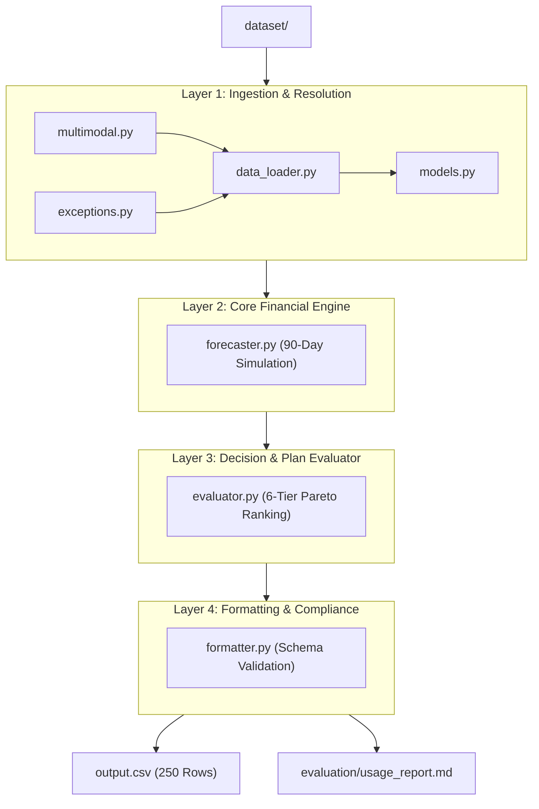

# Buy or Wait? -- AI Financial Decision Agent

Starter and evaluation package for the **HackerRank Orchestrate** 24-hour hackathon challenge (September 2026).

-> Hackathon Link: https://github.com/interviewstreet/hackerrank-orchestrate-september26

---

## 1. Overview

**Buy or Wait?** is an AI-powered financial decision agent that determines whether a user can safely afford a requested purchase or payment.

Rather than relying solely on current available balance, the system reconstructs the user's complete financial trajectory across a 90-day forward forecast. It accounts for:
- Historical and scheduled recurring commitments (rent, utilities, debt repayment, subscriptions, insurance)
- Conservative cadence projections for essential living necessities (groceries, transport)
- Immediate reservation of pending debits (protecting against double-spending)
- Hard conservation of the user's `minimum_balance_to_keep` across all projected days
- Rejection of unconfirmed, speculative inflows (unsettled bonuses, commissions, refunds, investment gains)
- Provider payment options (full payment, installments, partial payment, wait, or rejection)
- Contextual multimodal evidence from messages and receipts

For every purchase or payment request in `dataset/requests.csv`, the engine outputs a fully validated, deterministic recommendation in `output.csv`.

---

## 2. Dependencies & Runtime Environment

- **External Dependencies:** **0** (Zero `pip` packages required)
- **Runtime:** Pure Python 3.12 Standard Library
- **Network / API Calls:** **0** (100% offline, isolated container execution)
- **Deterministic:** All calculations avoid floating-point drift and use strict tie-breakers

---

## 3. How to Run

### 3.1 Full Production Evaluation
Execute the main entry point to evaluate all 250 requests in `dataset/requests.csv` and generate root `output.csv`:

```bash
python3 code/main.py
```

This processes all requests, executes full 90-day cashflow simulation, validates compliance invariants, outputs `output.csv` (251 lines including header), and refreshes `evaluation/usage_report.md`.

### 3.2 Run Unit Test Suite
Execute all 51 comprehensive domain unit tests with full verbosity:

```bash
python3 -m unittest discover -s code/tests -v
```

Expected result: **51/51 tests passing** (~1.0s execution time).

### 3.3 Run Golden Benchmark Harness
Execute the golden benchmark harness against the 25 ground-truth requests in `dataset/sample_requests.csv`:

```bash
python3 code/evaluation/benchmark.py
```

Outputs detailed field-level scorecards for affordability status, payment method, payment plan, earliest payment date, spending changes, and safe amounts.

---

## 4. System Architecture

The engine implements a strict 4-layer unidirectional pipeline:



### Layer 1: Ingestion & Resolution
- **Modules:** `code/data_loader.py`, `code/models.py`, `code/multimodal.py`, `code/exceptions.py`
- **Responsibilities:** Ingests structured profiles, dated exchange rates, financial events, and payment options. Resolves untrusted message evidence (payroll rescheduling, salary adjustments, termination notices) and image receipts via visual hash matching. Fails loudly on schema violations.

### Layer 2: Core Financial Engine
- **Module:** `code/forecaster.py`
- **Responsibilities:** Simulates day-by-day cash balance $B(t)$ over a 90-day forward horizon $[T_0, T_0 + 90]$. Reserves pending debits immediately. Rejects speculative credits. Forward-projects regular salary, billing-day utilities, fixed recurring commitments, and cadence-based living necessities (`groceries`, `transport`). Enforces hard conservation of `minimum_balance_to_keep`.

### Layer 3: Decision & Plan Evaluator
- **Module:** `code/evaluator.py`
- **Responsibilities:** Formulates candidate plans across all permissible payment methods (`full_payment`, `installments`, `partial_payment`, `wait`, `not_recommended`). Respects user payment preferences and `max_installment_months`. Resolves flexible spending changes (`stop:` and `reduce_to:`). Ranks all viable options using a strict 6-tier lexicographical comparator.

### Layer 4: Formatting & Compliance
- **Module:** `code/formatter.py`
- **Responsibilities:** Formats chronological payment schedules (`YYYY-MM-DD:amount|...`) and spending change strings without floating-point artifacts. Executes 6 domain schema validation checks on every row before serialization.

---

## 5. Development Methodology & Engineering Governance

Built under rigorous engineering principles documented in the codebase:

- **Strict TDD (Test-Driven Development):** Tests were written and validated red-to-green before logic implementation.
- **Fail-Loudly Error Handling:** Missing currencies, corrupt schemas, or illegal states raise explicit domain exceptions rather than silently defaulting.
- **Float Hygiene:** All currency conversions and payment splits round cleanly to 2 decimal places to prevent drift.

### Governance Documentation Index
- [`code/architecture.md`](./architecture.md): Full architectural specifications and data flow contracts.
- [`code/decisions.md`](./decisions.md): Architectural Decision Records (ADRs) detailing design trade-offs.
- [`code/development-principle.md`](./development-principle.md): Non-negotiable development rules and failure policies.
- [`code/dos-dont.md`](./dos-dont.md): Engineering invariants, guidelines, and prohibitions.
- [`code/orchestration.md`](./orchestration.md): Execution lifecycle and evaluation workflows.
- [`code/rulebook.md`](./rulebook.md): Core operational standards and submission rules.

---

## 6. Token Usage & Evaluation Report

In strict compliance with hackathon constraints:
- **Model Providers:** None (100% Offline Rule-Based Mathematical Simulation Engine)
- **Model API Calls:** 0
- **Total Tokens Consumed:** 0 (0 input tokens, 0 output tokens)
- **Total Cost (USD):** $0.00

See [`evaluation/usage_report.md`](../evaluation/usage_report.md) for the verified full-dataset execution report.
